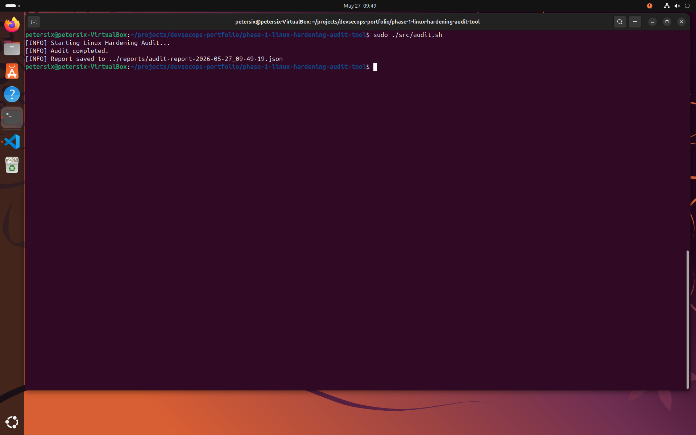
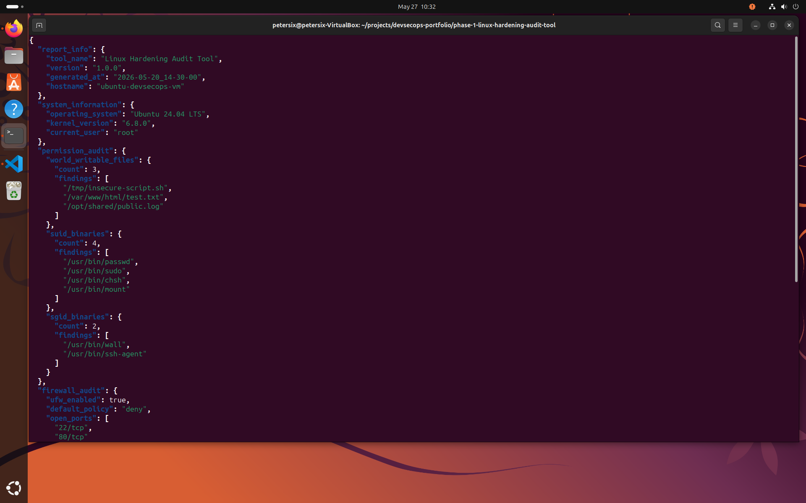
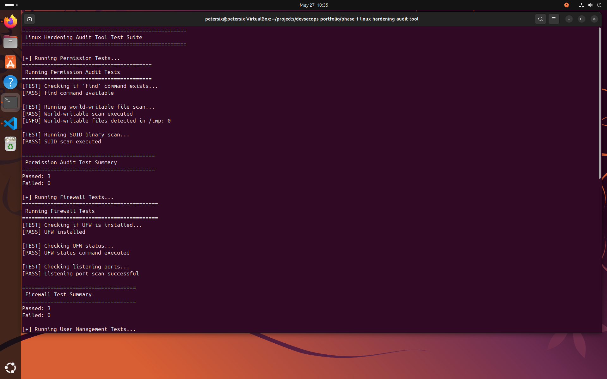
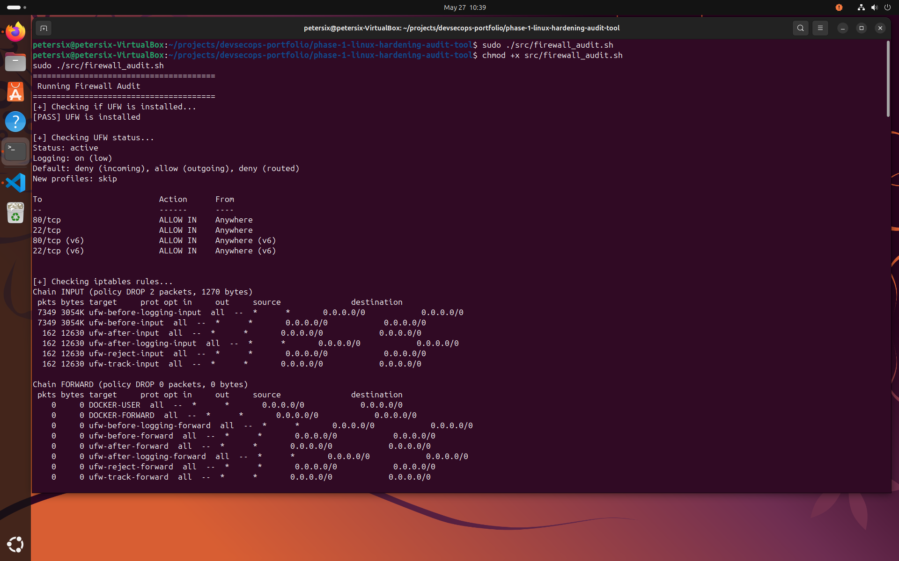

# Phase 1 - Linux Hardening Audit Tool

A Bash-based Linux security auditing and hardening toolkit focused on:
- least privilege enforcement
- permission auditing
- firewall validation
- log management
- system security checks

---

## Features

- User & group auditing
- World-writable file detection
- SUID/SGID detection
- UFW firewall checks
- JSON reporting

---

## Planned Features

- CIS benchmark alignment
- SIEM export
- Docker support

## Project Structure

```text
phase-1-linux-hardening-audit-tool/
├── config/
├── docs/
├── logs/
├── reports/
├── sample-output/
├── screenshots/
├── src/
├── tests/
└── users/
```

```text
phase-1-linux-hardening-audit-tool/
├── config
│   └── audit.conf
├── docs
│   ├── architecture.md
│   └── threat-model.md
├── logs
│   └── .gitkeep
├── reports
│   └── .gitkeep
├── sample-output
│   └── sample-report.json
├── screenshots
│   ├── audit-run.png
│   ├── firewall-audit.png
│   ├── json-report.png
│   └── test-suite.png
├── src
│   ├── audit.sh
│   ├── firewall_audit.sh
│   ├── log_rotation.sh
│   ├── permission_audit.sh
│   ├── user_management.sh
│   └── utils.sh
├── tests
│   ├── run_tests.sh
│   ├── test_firewall.sh
│   ├── test_logs.sh
│   ├── test_permissions.sh
│   └── test_users.sh
├── users
│   └── users.txt
├── .gitignore
├── LICENSE
└── README.md
```

## Skills Demonstrated

- Linux administration
- Bash scripting
- System hardening
- User management
- Firewall auditing
- Log management
- Security automation
- JSON reporting
- Least privilege enforcement


## Screenshots

### Audit Execution

Shows the Linux hardening audit tool generating a JSON security report.



---

### JSON Report Output

Structured JSON audit report generated by the tool.



---

### Test Suite

Full automated Bash test suite validating audit functionality.



---

### Firewall Audit

Firewall auditing module validating UFW configuration and listening ports.

